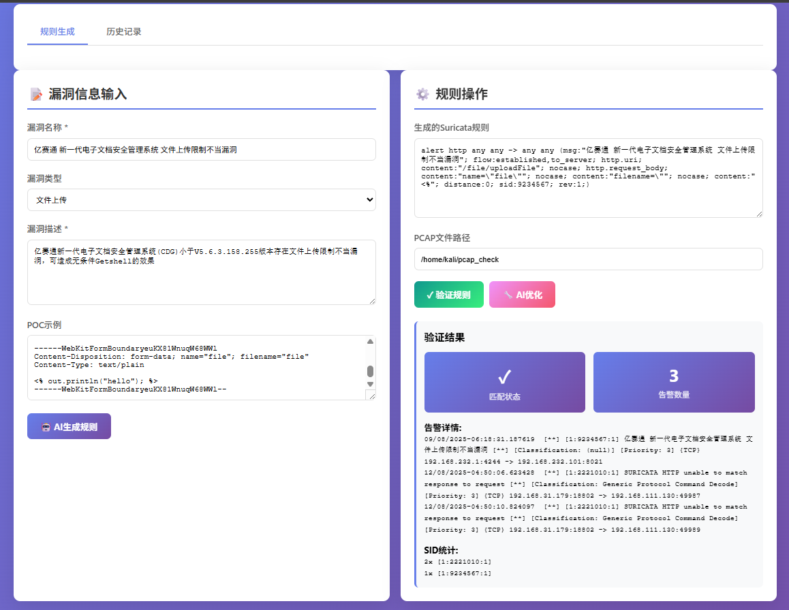
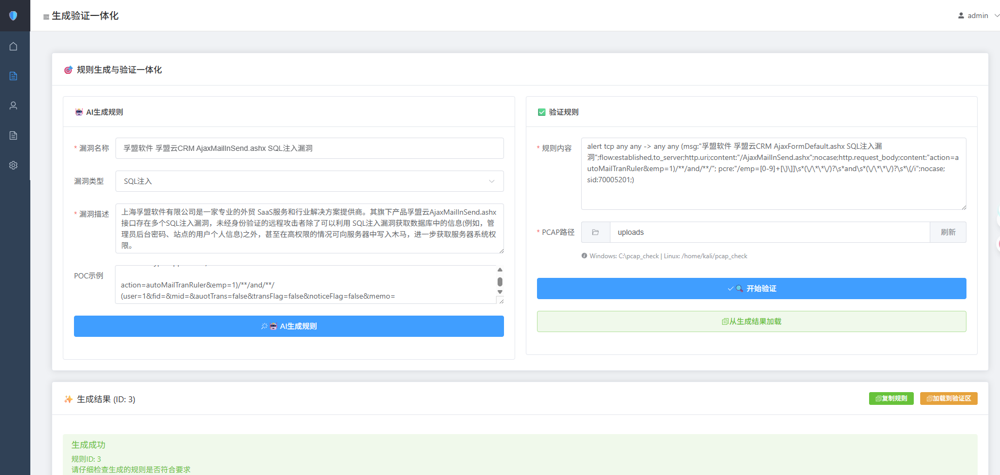
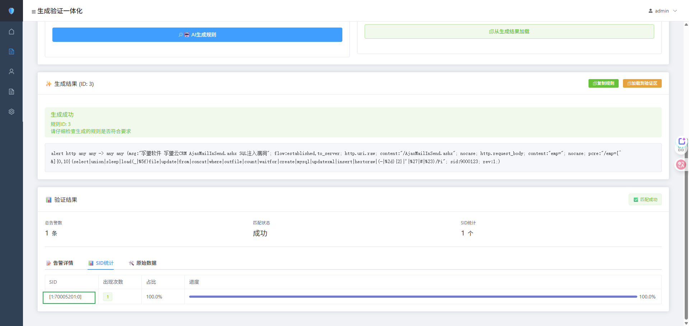
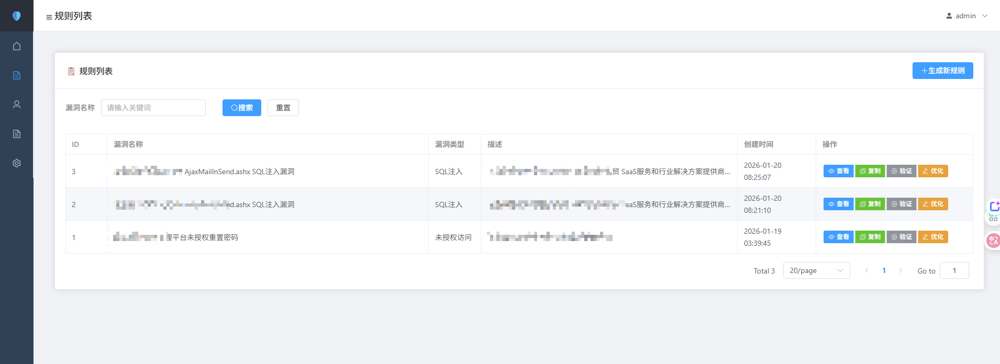

<div align="center">

# 🛡️ Suricata规则生成与验证工具

### 基于AI的智能Suricata规则生成、优化与自动化验证平台

<p align="center">
  <a href="#"></a>
  <a href="#"></a>
  <a href="#"></a>
  <a href="#"></a>
  <a href="#"></a>
  <a href="https://github.com/rockmelodies/suricata_ai_gen/stargazers"></a>
</p>

<p align="center">
  <a href="#功能特性">功能特性</a> •
  <a href="#快速开始">快速开始</a> •
  <a href="#部署方式">部署方式</a> •
  <a href="#使用指南">使用指南</a>
</p>


</div>

## 功能特性

### 🚀 V2.0 新特性

- 🔐 **JWT认证** - 完整的用户认证和授权系统
- 👥 **用户管理** - 用户注册、登录、权限管理
- 📖 **OpenAPI规范** - 符合OpenAPI 3.0标准，自动生成Swagger文档
- 🎯 **RESTful API** - 基于Flask-RESTX的标准化API设计
- 🔄 **前后端分离** - Vue3 + TypeScript + Element Plus现代化前端

### ✨ 核心功能

✨ **AI智能生成** - 基于360AI大模型，根据漏洞描述自动生成Suricata规则  
🔧 **规则优化** - AI辅助优化规则，提高检测准确率  
✅ **自动验证** - 集成Suricata引擎，自动验证规则有效性  
📊 **数据管理** - SQLite数据库存储规则历史和验证结果  
🎨 **友好界面** - Vue3前端，简洁美观的用户界面  

### 老版本




### 新版本





## 部署方式

### 🐧 Linux/Kali部署

#### 1. 系统准备

```bash
# 更新系统
sudo apt update && sudo apt upgrade -y

# 安装依赖
sudo apt install python3 python3-venv python3-pip nodejs npm git suricata -y
```

#### 2. 克隆项目并配置

```bash
git clone https://github.com/rockmelodies/suricata_ai_gen.git
cd suricata_ai_gen

# 复制配置文件
cp .env.example .env

# 编辑配置文件，设置API密钥等
nano .env
```

#### 3. 创建虚拟环境

```bash
python3 -m venv .venv
source .venv/bin/activate
pip install --upgrade pip
pip install -r backend/requirements.txt
```

#### 4. 启动服务

```bash
# 启动后端
cd backend
source ../.venv/bin/activate
python app_v2.py  # 或者 python app_with_auth.py

# 启动前端
cd ../frontend-vue3
npm install
npm run dev
```

**说明**: 我们提供了两个后端入口文件：
- `app_v2.py`: 基于Flask-RESTX的现代化API服务，支持OpenAPI文档和JWT认证（推荐）
- `app_with_auth.py`: 带用户认证功能的完整版本

推荐使用 `app_v2.py` 进行开发和部署。

### 🐳 Docker部署

#### 1. 安装Docker

```bash
sudo apt update
sudo apt install docker.io docker-compose -y
sudo systemctl start docker
sudo systemctl enable docker
sudo usermod -aG docker $USER
```

#### 2. 使用Docker部署

```bash
# 进入docker目录
cd docker

# 构建并启动服务
docker-compose up -d

# 查看服务状态
docker-compose ps

# 查看日志
docker-compose logs -f
```

### 🔧 自动化部署

我们提供了一键部署脚本：

```bash
chmod +x deploy.sh
./deploy.sh
```

## 快速开始

### 配置环境变量

编辑 `.env` 文件：

```bash
# LLM 通用配置
LLM_PROVIDER=360
LLM_API_KEY=your_api_key_here
LLM_MODEL=360gpt-pro

# 数据库配置
DB_PATH=./suricata_rules.db

# Suricata 配置 (Linux/Kali)
SURICATA_RULES_DIR=/var/lib/suricata/rules
SURICATA_CONFIG=/etc/suricata/suricata.yaml
SURICATA_LOG_DIR=/var/log/suricata
```

### 访问应用

- **前端应用**：http://localhost:5173
- **Swagger文档**：http://localhost:5000/api/docs
- **API地址**：http://localhost:5000/api

### 默认管理员账户

- 👤 用户名：`admin`
- 🔑 密码：`admin123`

⚠️ **重要**：生产环境请立即修改默认密码！

## 使用指南

### 功能模块

登录后您可以：

1. **生成验证一体化**：在同一页面完成规则生成和验证（推荐）
2. **生成规则**：输入漏洞信息，使用AI生成Suricata规则
3. **规则列表**：查看、管理、优化已生成的规则
4. **验证规则**：使用PCAP文件验证规则有效性
5. **用户管理**（仅管理员）：管理系统用户
6. **系统配置**：配置系统参数

### API使用示例

```bash
# 用户登录
curl -X POST http://localhost:5000/api/auth/login \
  -H "Content-Type: application/json" \
  -d '{"username":"admin","password":"admin123"}'

# 生成规则
curl -X POST http://localhost:5000/api/rules/generate \
  -H "Authorization: Bearer YOUR_TOKEN_HERE" \
  -H "Content-Type: application/json" \
  -d '{"vuln_name":"SQL注入","vuln_description":"测试漏洞"}'
```

## 许可证

MIT License - 详见 [LICENSE](LICENSE) 文件

---

<div align="center">

⭐ 如果这个项目对你有帮助，请给我们一个Star！

</div>