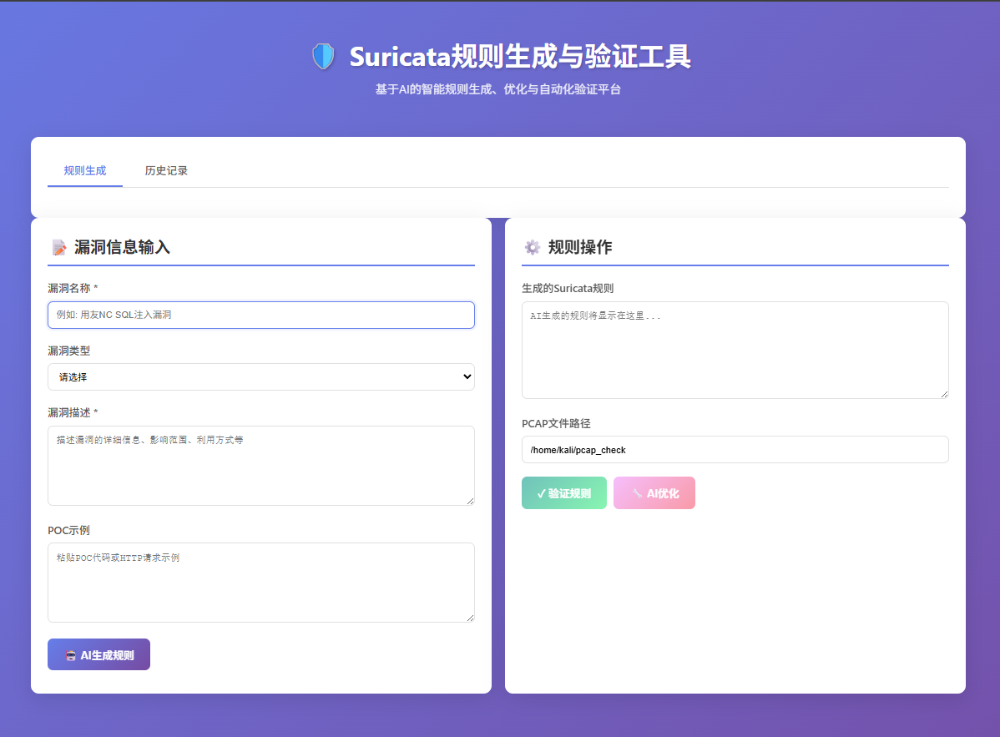
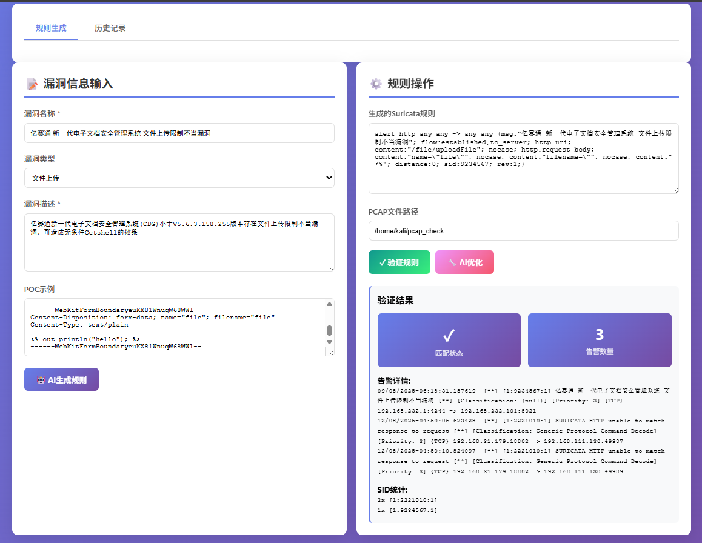
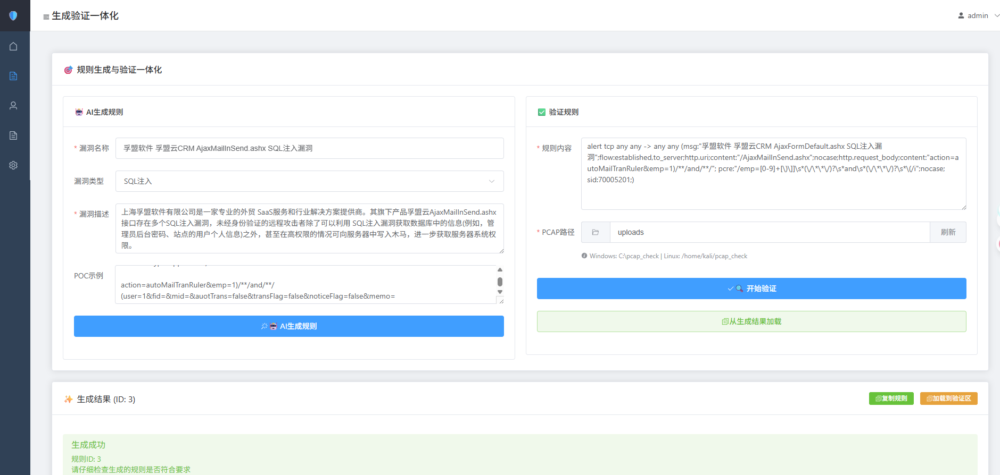
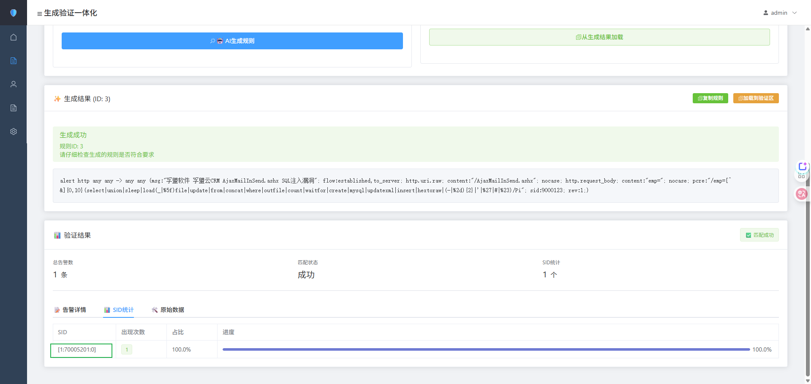
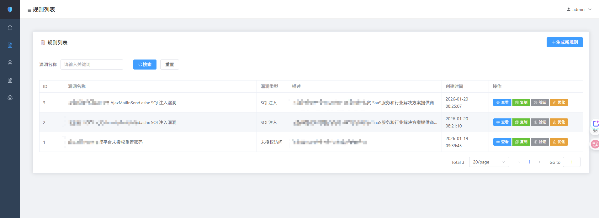

<div align="center">

# 🛡️ Suricata规则生成与验证工具

### 基于AI的智能Suricata规则生成、优化与自动化验证平台

<p align="center">
  <a href="https://github.com/rockmelodies/suricata_ai_gen"></a>
  <a href="https://github.com/rockmelodies/suricata_ai_gen"></a>
  <a href="https://github.com/rockmelodies/suricata_ai_gen"></a>
  <a href="https://github.com/rockmelodies/suricata_ai_gen"></a>
  <a href="https://github.com/rockmelodies/suricata_ai_gen"></a>
</p>

<p align="center">
  <a href="https://github.com/rockmelodies/suricata_ai_gen/stargazers"></a>
  <a href="https://github.com/rockmelodies/suricata_ai_gen/network/members"></a>
  <a href="https://github.com/rockmelodies/suricata_ai_gen/issues"></a>
  <a href="https://github.com/rockmelodies/suricata_ai_gen/blob/main/LICENSE"></a>
</p>

<p align="center">
  
  
  
  
</p>

<p align="center">
  <a href="#-功能特性">✨ 功能特性</a> •
  <a href="#-快速开始">🚀 快速开始</a> •
  <a href="#-部署方式">📦 部署方式</a> •
  <a href="#-使用指南">📖 使用指南</a> •
  <a href="#-api文档">🔌 API文档</a>
</p>

<p align="center">
  <a href="https://github.com/rockmelodies/suricata_ai_gen">
    
  </a>
  <a href="https://github.com/rockmelodies/suricata_ai_gen">
    
  </a>
  <a href="https://github.com/rockmelodies/suricata_ai_gen/releases">
    
  </a>
</p>

</div>

## ✨ 功能特性

### 🚀 V2.0 新特性

| 特性 | 描述 | 状态 |
|------|------|------|
| 🔐 **JWT认证** | 完整的用户认证和授权系统 | ✅ 已完成 |
| 👥 **用户管理** | 用户注册、登录、权限管理 | ✅ 已完成 |
| 📖 **OpenAPI规范** | 符合OpenAPI 3.0标准，自动生成Swagger文档 | ✅ 已完成 |
| 🎯 **RESTful API** | 基于Flask-RESTX的标准化API设计 | ✅ 已完成 |
| 🔄 **前后端分离** | Vue3 + TypeScript + Element Plus现代化前端 | ✅ 已完成 |
| 🐳 **Docker支持** | 多阶段构建，一键部署 | ✅ 已完成 |
| 🧪 **自动化测试** | 完整的API测试和验证 | 🚧 进行中 |

### ✨ 核心功能

<table>
<tr>
<td width="50%">

#### 🤖 AI 智能生成
- 基于360AI大模型
- 根据漏洞描述自动生成Suricata规则
- 支持多种漏洞类型识别

</td>
<td width="50%">

#### 🔧 规则优化
- AI辅助优化规则
- 提高检测准确率
- 减少误报率

</td>
</tr>
<tr>
<td width="50%">

#### ✅ 自动验证
- 集成Suricata引擎
- 自动验证规则有效性
- 支持PCAP文件测试

</td>
<td width="50%">

#### 📊 数据管理
- SQLite数据库存储
- 规则历史追踪
- 验证结果记录

</td>
</tr>
</table>

### 📸 界面预览

<details>
<summary><b>🖼️ 点击查看截图</b></summary>

#### 老版本



#### 新版本




</details>
## 📦 部署方式

### 🐳 Docker部署（推荐）

[](https://hub.docker.com/r/rockmedia/suricata-ai-backend)

#### 📦 Docker Hub镜像

我们已经将应用容器化并推送到Docker Hub，你可以直接拉取使用：

| 服务 | Docker Hub镜像 | 版本 | 大小 |
|------|---------------|------|------|
| 后端API | `rockmedia/suricata-ai-backend:latest` |  |  |
| 前端Web | `rockmedia/suricata-frontend:latest` |  |  |

#### 🚀 快速启动（使用Docker Hub镜像）

##### 方法一：手动启动

```bash
# 1. 拉取镜像
docker pull rockmedia/suricata-ai-backend:latest
docker pull rockmedia/suricata-frontend:latest

# 2. 创建必要的目录
mkdir -p uploads

# 3. 创建配置文件
cp .env.example .env
# 编辑.env文件，设置你的API密钥等配置

# 4. 启动后端服务
docker run -d \
  --name suricata-backend \
  -p 5000:5000 \
  -v $(pwd)/uploads:/app/uploads \
  -v $(pwd)/.env:/app/.env \
  --restart unless-stopped \
  rockmedia/suricata-ai-backend:latest

# 5. 启动前端服务
docker run -d \
  --name suricata-frontend \
  -p 5173:80 \
  --add-host=host.docker.internal:host-gateway \
  --restart unless-stopped \
  rockmedia/suricata-frontend:latest
```

##### 方法二：使用docker-compose（推荐）

创建 `docker-compose.yml` 文件：

```yaml
version: '3.8'

services:
  backend:
    image: rockmedia/suricata-ai-backend:latest
    container_name: suricata-backend
    ports:
      - "5000:5000"
    volumes:
      - ./uploads:/app/uploads
      - ./.env:/app/.env
    restart: unless-stopped
    networks:
      - suricata-network

  frontend:
    image: rockmedia/suricata-frontend:latest
    container_name: suricata-frontend
    ports:
      - "5173:80"
    depends_on:
      - backend
    extra_hosts:
      - "host.docker.internal:host-gateway"
    restart: unless-stopped
    networks:
      - suricata-network

networks:
  suricata-network:
    driver: bridge
```

然后启动服务：

```bash
# 启动服务
docker-compose up -d

# 查看服务状态
docker-compose ps

# 查看日志
docker-compose logs -f

# 停止服务
docker-compose down
```

#### 🌐 访问应用

- **前端界面**: http://localhost:5173
- **后端API**: http://localhost:5000
- **API健康检查**: http://localhost:5000/api/health
- **默认管理员账户**: `admin` / `admin123`（生产环境请修改）

#### 🔧 管理命令

```bash
# 查看容器状态
docker ps --filter "name=suricata"

# 查看后端日志
docker logs suricata-backend

# 查看前端日志
docker logs suricata-frontend

# 重启服务
docker restart suricata-backend suricata-frontend

# 停止服务
docker stop suricata-backend suricata-frontend

# 删除服务
docker rm suricata-backend suricata-frontend
```

### 🐧 本地开发部署

#### 1. 系统准备

```bash
# 更新系统
sudo apt update && sudo apt upgrade -y

# 安装依赖
sudo apt install python3 python3-venv python3-pip nodejs npm git suricata -y
```

#### 2. 克隆项目并配置

```bash
git clone https://github.com/rockmelodies/suricata_ai_gen.git
cd suricata_ai_gen

# 复制配置文件
cp .env.example .env

# 编辑配置文件，设置API密钥等
nano .env
```

#### 3. 创建虚拟环境

```bash
#需要在特权环境下运行
python3 -m venv .venv
source .venv/bin/activate
pip install --upgrade pip
pip install -r backend/requirements.txt

#在非特权环境运行
sudo -H /home/kali/installpackage/suricata_ai_gen/.venv/bin/python app_v2.py
```

#### 4. 启动服务

```bash
# 启动后端
cd backend
source ../.venv/bin/activate
python app_v2.py  # 或者 python app_with_auth.py

# 启动前端
cd ../frontend-vue3
npm install
npm run dev
```

**说明**: 我们提供了两个后端入口文件：
- `app_v2.py`: 基于Flask-RESTX的现代化API服务，支持OpenAPI文档和JWT认证（推荐）
- `app_with_auth.py`: 带用户认证功能的完整版本

推荐使用 `app_v2.py` 进行开发和部署。

### 🔧 自动化部署

我们提供了一键部署脚本：

```bash
chmod +x deploy.sh
./deploy.sh
```

## 🚀 快速开始

### 📋 前提条件

- Python 3.11+ 或 Docker
- Node.js 20+ (前端开发)
- 360AI API密钥

### ⚙️ 配置环境变量

```bash
# 复制配置文件
cp .env.example .env

# 编辑 .env 文件
nano .env
```

<details>
<summary><b>🔑 配置文件示例</b></summary>

```bash
# ============================================
# LLM 配置
# ============================================
LLM_PROVIDER=360
LLM_API_KEY=your_api_key_here
LLM_MODEL=360gpt-pro

# ============================================
# 数据库配置
# ============================================
DB_PATH=./suricata_rules.db

# ============================================
# Suricata 配置 (Linux/Kali)
# ============================================
SURICATA_RULES_DIR=/var/lib/suricata/rules
SURICATA_CONFIG=/etc/suricata/suricata.yaml
SURICATA_LOG_DIR=/var/log/suricata

# ============================================
# JWT 配置
# ============================================
JWT_SECRET_KEY=your-secret-key-here
JWT_ACCESS_TOKEN_EXPIRES=24

# ============================================
# Flask 配置
# ============================================
FLASK_HOST=0.0.0.0
FLASK_PORT=5000
FLASK_ENV=production
```

</details>

### 🌐 访问应用

| 服务 | 地址 | 说明 |
|------|------|------|
| 🎨 **前端应用** | http://localhost:5173 | Vue3 用户界面 |
| 📚 **Swagger文档** | http://localhost:5000/api/docs | API 文档 |
| 🔌 **API地址** | http://localhost:5000/api | RESTful API |
| 💓 **健康检查** | http://localhost:5000/api/health | 服务状态 |

### 👤 默认管理员账户

| 字段 | 值 |
|------|-----|
| 用户名 | `admin` |
| 密码 | `admin123` |

> ⚠️ **重要**：生产环境请立即修改默认密码！

## 📖 使用指南

### 🎯 功能模块

登录后您可以：

| 功能 | 描述 | 适用场景 |
|------|------|----------|
| 🔄 **生成验证一体化** | 在同一页面完成规则生成和验证 | 快速验证新规则 |
| ✨ **生成规则** | 输入漏洞信息，使用AI生成Suricata规则 | 创建新检测规则 |
| 📋 **规则列表** | 查看、管理、优化已生成的规则 | 规则管理和维护 |
| ✅ **验证规则** | 使用PCAP文件验证规则有效性 | 规则测试和验证 |
| 👥 **用户管理** | 管理系统用户（仅管理员） | 权限管理 |
| ⚙️ **系统配置** | 配置系统参数 | 系统设置 |

### 🔌 API使用示例

<details>
<summary><b>📡 查看 API 示例</b></summary>

#### 用户登录
```bash
curl -X POST http://localhost:5000/api/auth/login \
  -H "Content-Type: application/json" \
  -d '{
    "username": "admin",
    "password": "admin123"
  }'
```

#### 生成规则
```bash
curl -X POST http://localhost:5000/api/rules/generate \
  -H "Authorization: Bearer YOUR_TOKEN_HERE" \
  -H "Content-Type: application/json" \
  -d '{
    "vuln_name": "SQL注入",
    "vuln_description": "测试漏洞描述",
    "vuln_type": "SQL注入"
  }'
```

#### 验证规则
```bash
curl -X POST http://localhost:5000/api/rules/validate \
  -H "Authorization: Bearer YOUR_TOKEN_HERE" \
  -H "Content-Type: application/json" \
  -d '{
    "rule_content": "alert tcp any any -> any 80 (msg:\"SQL Injection\"; content:\"SELECT\"; sid:1000001; rev:1;)",
    "pcap_path": "/path/to/test.pcap"
  }'
```

</details>

## 🔌 API文档

启动服务后，访问 Swagger UI 查看完整 API 文档：

- 📚 **Swagger UI**: http://localhost:5000/api/docs
- 📋 **OpenAPI Spec**: http://localhost:5000/api/swagger.json

## 🤝 贡献指南

我们欢迎所有形式的贡献！

[](https://github.com/rockmelodies/suricata_ai_gen/graphs/contributors)
[](https://github.com/rockmelodies/suricata_ai_gen/pulls)

### 提交 PR 流程

1. 🍴 Fork 本仓库
2. 🌿 创建你的 Feature 分支 (`git checkout -b feature/AmazingFeature`)
3. 💾 提交你的修改 (`git commit -m 'Add some AmazingFeature'`)
4. 📤 推送到分支 (`git push origin feature/AmazingFeature`)
5. 🔃 打开一个 Pull Request

## 📊 项目统计

<p align="center">
  
</p>

## 📝 更新日志

查看 [CHANGELOG.md](CHANGELOG.md) 了解详细的更新历史。

## 📄 许可证

本项目采用 MIT 许可证 - 详见 [LICENSE](LICENSE) 文件

[](https://opensource.org/licenses/MIT)

---

<div align="center">

### 🌟 如果这个项目对你有帮助，请给我们一个 Star！

[](https://github.com/rockmelodies/suricata_ai_gen/stargazers)

**Made with ❤️ by [rockmelodies](https://github.com/rockmelodies)**

<p align="center">
  <a href="https://github.com/rockmelodies">GitHub</a> •
  <a href="mailto:your.email@example.com">Email</a>
</p>

</div>