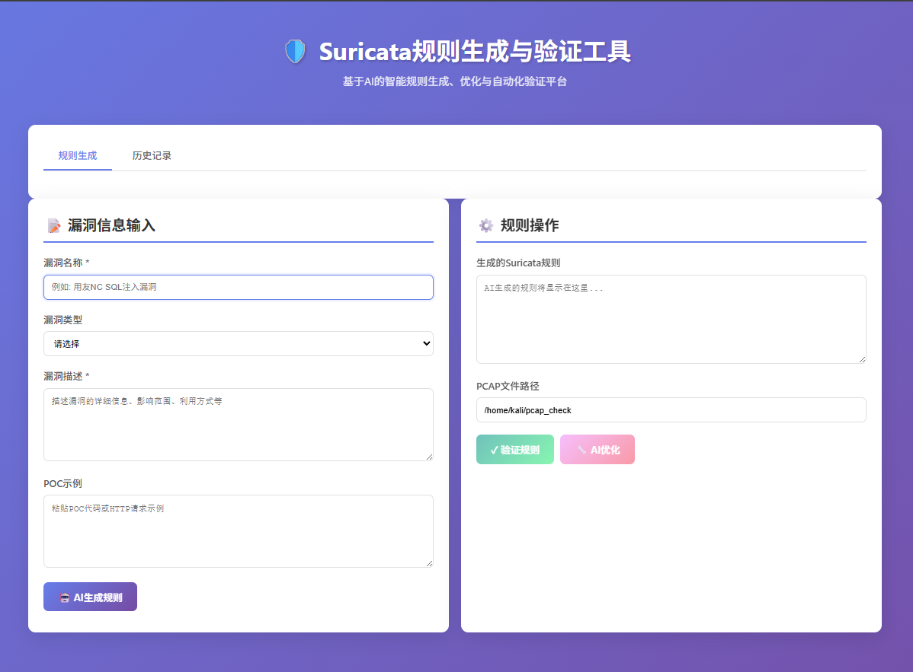

<div align="center">

# 🛡️ Suricata Rule Generator & Validator

### AI-Powered Intelligent Suricata Rule Generation, Optimization & Automated Validation Platform

<p align="center">
  <a href="#"></a>
  <a href="#"></a>
  <a href="#"></a>
  <a href="#"></a>
  <a href="#"></a>
  <a href="https://github.com/rockmelodies/suricata_ai_gen/stargazers"></a>
</p>

<p align="center">
  <a href="#features">Features</a> •
  <a href="#quick-start">Quick Start</a> •
  <a href="#usage-guide">Usage</a> •
  <a href="#api-documentation">API Docs</a> •
  <a href="#contributing">Contributing</a>
</p>

<p align="center">
  <a href="README.md">简体中文</a> |
  <a href="README_EN.md">English</a>
</p>

---


</div>

## Features

✨ **AI Generation** - Auto-generate Suricata rules based on 360AI model  
🔧 **Rule Optimization** - AI-assisted optimization for better accuracy  
✅ **Auto Validation** - Integrated Suricata engine for automatic validation  
📊 **Data Management** - SQLite database for rule history and results  
🎨 **Friendly UI** - Vue3 frontend with clean and elegant interface  




## Architecture

```
suricata_ai_gen/
├── backend/              # Backend (Python + Flask)
│   ├── app.py           # Flask application
│   ├── ai_client.py     # 360AI client
│   ├── database.py      # Database management
│   ├── suricata_validator.py  # Suricata validator
│   ├── config.py        # Configuration
│   └── requirements.txt # Python dependencies
├── frontend/            # Frontend (Vue3)
│   └── index.html      # Single page app
├── start_all.bat       # Windows startup script
└── start_all.sh        # Linux startup script
```

## Requirements

### Windows Development
- Python 3.8+
- Browser (Chrome/Edge/Firefox)

### Kali Linux Validation (Optional)
- Suricata 6.0+
- PCAP test files

## Quick Start

### 1. Configure Environment Variables

**Important: Configure API key for security**

Copy environment template:
```bash
# Windows
copy .env.example .env

# Linux
cp .env.example .env
```

Edit `.env` file and set your AI API key:
```bash
# 360 AI API Configuration
AI_API_KEY=your_api_key_here  # Replace with your actual API key
AI_MODEL=360gpt-pro
```

### 2. Install Dependencies

```bash
# Create virtual environment
python -m venv .venv

# Activate virtual environment
# Windows
.venv\Scripts\activate
# Linux
source .venv/bin/activate

# Install dependencies
pip install -r backend\requirements.txt
```

### 3. Start Services

**Windows:**
```bash
start_all.bat
```

**Linux/Kali:**
```bash
chmod +x start_all.sh
./start_all.sh
```

### 4. Access Application

Open browser and visit: `http://localhost:8080`

## Usage Guide

### Rule Generation Workflow

1. **Input Vulnerability Info**
   - Vulnerability name (required)
   - Vulnerability type (SQL injection, command injection, etc.)
   - Vulnerability description (required)
   - POC example (optional)

2. **AI Generate Rule**
   - Click "🤖 AI Generate Rule" button
   - AI will auto-generate Suricata rule

3. **Validate Rule**
   - Set PCAP file path
   - Click "✓ Validate Rule" button
   - View validation results and statistics

4. **Optimize Rule**
   - Based on validation results, click "🔧 AI Optimize"
   - Input optimization suggestions (optional)
   - AI will generate improved rule

## API Documentation

### Generate Rule
```http
POST /api/rules/generate
Content-Type: application/json

{
  "vuln_name": "Vulnerability Name",
  "vuln_type": "sql_injection",
  "vuln_description": "Description",
  "poc": "POC Example"
}
```

### Optimize Rule
```http
POST /api/rules/optimize
Content-Type: application/json

{
  "rule_id": 1,
  "current_rule": "Current rule content",
  "feedback": "Optimization suggestions"
}
```

### Validate Rule
```http
POST /api/rules/validate
Content-Type: application/json

{
  "rule_content": "Rule content",
  "pcap_path": "/path/to/pcap"
}
```

## 🌟 Project Statistics

<div align="center">

| Type | Count | Description |
|------|-------|-------------|
| 💻 **Backend** | 6 files | ~1000 lines Python |
| 🎨 **Frontend** | 1 file | 646 lines Vue3 |
| 📚 **Documentation** | 8 files | ~3500 lines |
| ⚙️ **Scripts** | 7 | Windows + Linux |
| 🔌 **API** | 8 | RESTful API |

</div>

## 🎆 Tech Stack

<div align="center">

### Backend


### Frontend


### Tools & Platform


</div>

## ⭐ Star History

<div align="center">

[](https://star-history.com/rockmelodies/suricata_ai_gen&Date)

</div>

## 🤝 Contributing

Issues and Pull Requests are welcome!

<div align="center">

### Contributors

<a href="https://github.com/rockmelodies/suricata_ai_gen/graphs/contributors">
  
</a>

</div>

## 📝 License

<div align="center">

[](LICENSE)

This project is licensed under the MIT License - for learning and research purposes.

</div>

## 📧 Contact

<div align="center">

For questions or suggestions:

[](https://github.com/rockmelodies/suricata_ai_gen/issues)
[](mailto:rockysocket@gmail.com)

</div>

---

<div align="center">

### ❤️ Thank You

If this project helps you, please give it a Star ⭐!

[](https://github.com/rockmelodies/suricata_ai_gen/stargazers)
[](https://github.com/rockmelodies/suricata_ai_gen/network/members)
[](https://github.com/rockmelodies/suricata_ai_gen/watchers)

**Made with ❤️ by Security Researchers**

</div>
